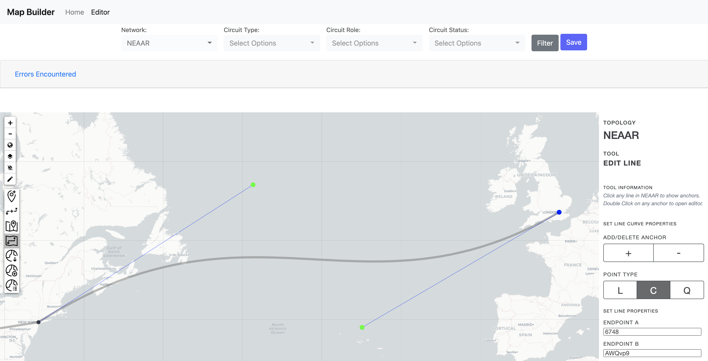

# GlobalNOC Worldview Panel

The Network Map Panel is a world map that provides the ability to monitor and visualize realtime traffic statistics. It uses timeseries data to represent traffic between nodes as circuits. It provides this information when hovered over the circuits and nodes.

This template is a starting point for building Grafana Panel Plugins in Grafana 7.0+

## What is Grafana Panel Plugin?

Panels are the building blocks of Grafana. They allow you to visualize data in different ways. While Grafana has several types of panels already built-in, you can also build your own panel, to add support for other visualizations.

For more information about panels, refer to the documentation on [Panels](https://grafana.com/docs/grafana/latest/features/panels/panels/)

## Installation

1. Install dependencies

   ```bash
   yarn install
   ```

2. Build plugin in development mode or run in watch mode

   ```bash
   yarn dev
   ```

   or

   ```bash
   yarn watch
   ```

3. Build plugin in production mode

   ```bash
   yarn build
   ```

4. Create a symlink to the `globalnoc-worldview-panel/dist` directory or place the `globalnoc-worldview-panel/dist` directory inside Grafana's plugin directory

## Using Atlas Editor To Edit Custom Maps


<p>Clicking on the pen  in the upper right corner toggles the atlas editor. The toolbar displays the set of all tools available to edit a map:</p>

| Icon | Tool | Description |
| :------: | ------ | ------ |
|  | Add Node | Add new nodes to the map |
|  | Add Circuit | Add new circuits to the map |
|  | Edit Node | Edit existing nodes |
|  | Edit Lines | Edit existing circuits |
|  | Get JSON | Get Atlas4 formatted map JSON |
|  | Set Topology | Import map from JSON |
|  | Edit Topology | Edit Topology Features |

#### Add curves to circuit
<p>To add curves to a circuit, select  <code>Edit Lines</code> from the toolbar and click on the circuit that needs to be edited. Double click the circuit's anchor point which would have turned red in color. That would open a window in the sidebar on the right.</p> 

To add a cubic bezier curve, set the point type as `C`. To add a quadratic bezier curve, choose `Q`. To change the curve back to a line, choose `L`. If `C` or `Q` are selected, a green waypoint should appear in the middle of the circuit. Drag the waypoint to a desired location to change the magnitude of the curve.



#### Change map logo, description, link etc.
<p>Select <code>Edit Topology</code> . Click on <code>Manage Properties</code> that will open a form. Add/Edit top level map metadata in the form and press save to finalize the changes.</p>

